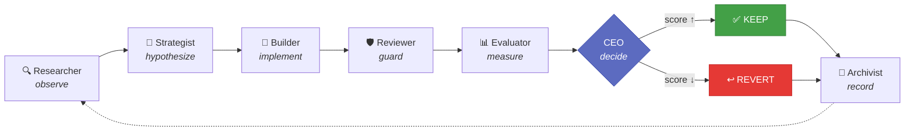
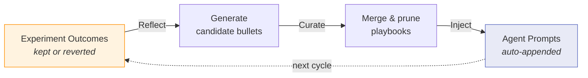
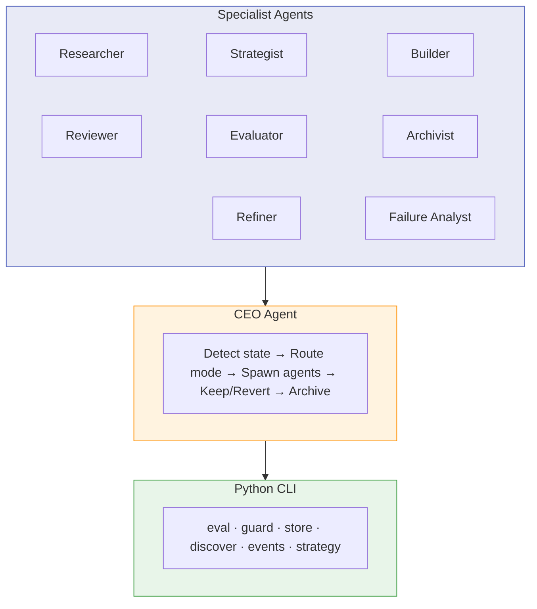
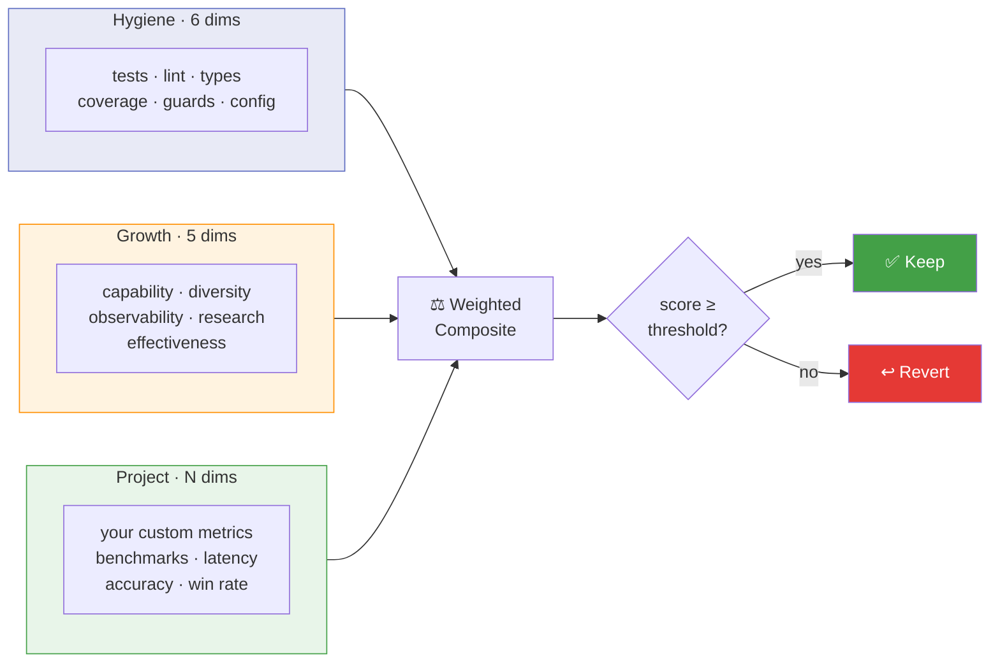

<p align="center">
  
</p>

[](https://github.com/akashgit/remote-factory/actions/workflows/ci.yml)
[](https://codecov.io/gh/akashgit/remote-factory)
[](https://www.python.org/downloads/)
[](LICENSE)
[](https://docs.anthropic.com/en/docs/claude-code)
[](https://bob.ibm.com)
[](https://openai.com/index/codex/)
[](https://akashgit.github.io/remote-factory/)

# re:factory

**Describe what you want. re:factory builds it, tests it, and keeps improving it — autonomously.**

You give it a spec file, a rough idea, or an existing codebase. re:factory researches best practices, scaffolds the project, sets up evaluation, and runs a continuous improvement loop — measuring every change and keeping only what makes things better. The agents that do this work learn from every experiment and get sharper over time.

```bash
# Design — brainstorm an idea, refine it, then build
factory ceo "distributed eval runner" --mode design

# Create — build new factory modes and pipelines
factory ceo /path/to/factory --mode create --focus "PR validation pipeline"

# Build — have a fleshed-out idea? Pass the file.
factory ceo ~/ideas/weather-dashboard.md

# Improve — point it at any codebase
factory ceo ~/my-project

# Focus — build exactly one thing
factory ceo ~/my-project --focus "add WebSocket support"
```

## How It Works



A CEO agent orchestrates eight specialists — Researcher, Strategist, Builder, Reviewer, Evaluator, Archivist, Refiner, and Failure Analyst — each running as an independent [Claude Code](https://docs.anthropic.com/en/docs/claude-code) subprocess. The Researcher searches the web and reads prior knowledge from the archive. The Strategist generates ranked hypotheses and handles design-mode ideation. The Builder implements one on an experiment branch. The Evaluator scores before and after. The CEO decides keep or revert. The Archivist records everything to `.factory/archive/` and regenerates performance reports for cross-project learning. In design mode, the Strategist synthesizes research into a buildable plan through user feedback. In research mode, the Failure Analyst classifies run failures to guide targeted hypothesis generation.

---

## Design Mode

Design mode is the primary way to use re:factory. It researches the space, drafts a structured plan via the Strategist, and lets you iterate on it before any code is written.

**From a raw idea** — describe what you want and refine it into a buildable spec:

```bash
factory ceo "distributed eval runner" --mode design
factory ceo "Build a REST API for bookmark management" --mode design
```

**From a spec file** — read and discuss before building:

```bash
factory ceo ~/ideas/weather-dashboard.md --mode design
factory ceo ~/ideas/my-app-spec.md --mode design
```

**On an existing project** — study the backlog, eval scores, open issues, and experiment history, then discuss what to work on before executing:

```bash
factory ceo ~/factory-projects/my-app --mode design
```

**Seed the conversation with a topic** — use `--focus` to start the discussion around a specific area:

```bash
factory ceo ~/factory-projects/my-app --mode design --focus "auth layer"
factory ceo ~/my-app --mode design --focus 42                       # GitHub issue
factory ceo ~/my-app --mode design --focus "owner/repo#42"          # Issue shorthand
factory ceo ~/my-app --mode design --focus '111 and 112'            # Multiple issues
factory ceo ~/my-app --mode design --focus 'issue 42, issue 43'    # With 'issue' keyword
```

---

## Create Your Own Factory/Mode

Create mode lets you build new factory modes — new workflows, new pipelines, new factories. Pass a description via `--focus` to tell the CEO what mode to create. It's fully interactive — the CEO researches existing patterns, synthesizes a workflow spec, gets your approval, then implements everything: workflow definition, SKILL.md, CLI wiring, and tests.

```bash
factory ceo /path/to/factory --mode create --focus "a mode that validates PRs with multi-stage checks"
```

To update an existing mode, prefix `--focus` with the mode name and a colon. The name before the colon is matched against registered workflows — if it matches, the CEO enters update mode instead of creating a new one:

```bash
factory ceo /path/to/factory --mode create --focus "improve: add plateau detection after 3 consecutive reverts"
factory ceo /path/to/factory --mode create --focus "build: add a code review gate after the builder"
```

Without a colon, `--focus` always creates a new mode.

The pipeline: **3 parallel researchers** (existing patterns, intent analysis, best practices) → **Strategist** synthesizes a workflow spec → **you approve** (like design mode) → **Builder** implements → **QA** verifies end-to-end → **PR**.

Point it at the factory repo itself to extend re:factory with custom pipelines.

---

## Other Workflows

### Build — start from an idea

```bash
factory ceo "Build a REST API for bookmark management"
factory ceo ~/ideas/weather-dashboard.md
factory ceo https://github.com/user/repo
```

Give re:factory an idea (raw string, spec file, or GitHub URL) and it builds a complete project: scaffolding, tests, eval, and iterative improvement.

### Improve — make an existing codebase better

```bash
factory ceo ~/my-project
factory run ~/my-project --loop
```

Point it at any codebase. Each cycle observes the project, hypothesizes changes, implements one, and keeps it only if the score goes up.

### Focus — build exactly one thing

```bash
factory ceo ~/my-project --focus "add authentication middleware"
factory ceo ~/my-project --focus 42              # Target GitHub issue #42
factory ceo ~/my-project --focus '111 and 112'   # Multiple issues
```

When you know exactly what you want, `--focus` pins a single backlog item, generates one hypothesis, runs one experiment, and exits.

### Research — optimize a metric iteratively

```bash
factory ceo "SWE-bench solver agent" --mode research
factory ceo ~/my-research-project --mode research
```

For projects with a measurable target metric (benchmark accuracy, solve rate, query precision). Research mode replaces the standard Improve loop with a specialized cycle: Baseline → Failure Analyst → Researcher → Strategist → Builder → Run → Verdict. See [Getting Started](docs/getting-started.md#research-mode-in-detail) for the full picture.

### Headless & continuous loop

```bash
factory ceo ~/my-project --headless            # No interaction
factory run ~/my-project --loop                 # Continuous improvement
factory tmux ~/my-project --loop                # Detached tmux session
```

---

## Quick Start

**Prerequisites:** Python 3.11+, [uv](https://docs.astral.sh/uv/#installation), and [Claude Code](https://docs.anthropic.com/en/docs/claude-code) (installed and authenticated).

### Quick Install

```bash
uv tool install git+https://github.com/akashgit/remote-factory.git
```

### Development Install

```bash
git clone https://github.com/akashgit/remote-factory.git
cd remote-factory
uv sync
uv tool install -e .
```

Then start with one of the two main workflows:

```bash
# Design — brainstorm an idea, refine it, then build
factory ceo "my idea" --mode design

# Improve an existing project — use design mode with a focus area
factory ceo /path/to/project --mode design --focus "issue # or area to improve"
```

See the [full setup guide](docs/setup.md) for authentication, environment variables, and justification for why we install globally.

---

## Self-Evolving Agents

| I want to… | Command |
|---|---|
| **Start from a raw idea** | `factory ceo "my idea" --mode design` |
| **Improve an existing project** | `factory ceo /path/to/project --mode design --focus "issue # or area to improve"` |
| **Target multiple issues** | `factory ceo /path/to/project --focus '111 and 112'` |
| **Create a new factory mode** | `factory ceo /path/to/factory --mode create --focus "mode description"` |
| **Update an existing mode** | `factory ceo /path/to/factory --mode create --focus "improve: add plateau detection"` |

re:factory doesn't just improve your project — it improves *itself*. Every keep/revert decision becomes training data for the next cycle.

This is powered by **ACE (Autonomous Context Engineering)** — inspired by Anthropic's work on [context engineering](https://www.anthropic.com/engineering/effective-context-engineering-for-ai-agents) — a Reflect → Curate → Inject loop that evolves agent playbooks from real experiment outcomes.



Each agent accumulates behavioral rules — DOs and DON'Ts — with evidence counters. Rules that correlate with kept experiments get reinforced. Rules that correlate with reverts get pruned.

```bash
# Run a full improvement cycle, then evolve all agent playbooks
factory ceo ~/my-project --mode meta
```

See [Self-Improvement Loop](docs/self-improvement.md) for the full picture. See [ACE Playbook Evolution](docs/ace.md) for the playbook mechanics.

---

## Architecture



re:factory is a three-layer system:

**Layer 1 — Python CLI** (`factory/`): Pure tools that don't make decisions. Eval runner, strategy engine, experiment store, discovery, event logging. Entry point: `factory --help`.

**Layer 2 — CEO Agent** (`factory/agents/prompts/ceo.md`): The orchestrator. Detects project state, spawns specialist agents, and makes the keep/revert decision for each experiment. Mode-specific playbooks are auto-generated from workflow graph definitions.

**Layer 3 — Specialist Agents** (`factory/agents/`): Eight independent Claude Code subprocesses — Researcher, Strategist, Builder, Reviewer, Evaluator, Archivist, Refiner, and Failure Analyst. Each has a focused prompt, receives context from the CEO, and returns structured output.

See [Architecture](docs/architecture.md) for the full deep-dive.

---

## The Eval System



| Tier | What it measures | Examples |
|------|-----------------|---------|
| **Hygiene** (6 dimensions) | Code quality basics | Tests, lint, type checking, coverage |
| **Growth** (5 dimensions) | Capability evolution | API surface area, experiment diversity, observability |
| **Project** (user-defined) | Domain-specific metrics | Benchmark accuracy, latency, win rate |

On first run, `factory discover` auto-detects your project's language and framework to generate the eval profile. See [Eval System](docs/eval.md) for scoring details, weights, and guards.

---

## Built with re:factory

re:factory has shipped something every day for the last 30 days — products, research experiments, production features, papers. Here are a few examples:

| Project | What it does | Mode |
|---------|-------------|------|
| **SWE-bench solver** | Autonomous agent that resolves GitHub issues from the SWE-bench dataset, iteratively improved via failure analysis | Research |
| **HMMT math solver** | Multi-agent team (Explorer, Theorist, Computationalist, Critic, Synthesizer) that solved HMMT Feb 2025 Combinatorics Problem 7 | Research |
| **Text/Sketch → CAD** | Converts natural language and hand-drawn sketches into executable CadQuery code for 3D model generation | Research |
| **HLS design space explorer** | Per-function AI agents explore HLS pragma/code variants in parallel, an ILP solver finds the optimal combination, then global expert agents apply cross-function optimizations — achieving up to 92% execution time reduction on cryptographic benchmarks | Build |
| **Pluck** | iOS app that extracts structured data from screenshots, links, and shared content using on-device AI | Build + Improve |
| **Group chat digest** | Turns iMessage group chats into weekly family newsletters with AI-curated highlights and photo selection | Build + Improve |
| **Production enterprise features** | Complete UI components and backend features shipped into a large-scale production codebase | Focus + Improve |
| **re:factory itself** | re:factory runs on itself in meta mode — its own agent playbooks are evolved from its own experiment outcomes | Meta |

Built something with re:factory? [Open a PR](https://github.com/akashgit/remote-factory/pulls) to add it here.

---

## CLI Quick Reference

```bash
# Design — brainstorm and build
factory ceo "idea" --mode design                              # Design from a raw idea
factory ceo ~/ideas/spec.md --mode design                     # Design from a spec file
factory ceo <path> --mode design                              # Design improvements for existing project
factory ceo <path> --mode design --focus "topic"              # Seed with a specific topic

# Create — extend the factory
factory ceo <path> --mode create --focus "description"        # Create a new factory mode
factory ceo <path> --mode create --focus "mode: change"       # Update an existing mode
```

See `factory --help` for the complete list.

---

## Runners

re:factory supports multiple CLI backends. Default is Claude Code — switch with `--runner` or `FACTORY_RUNNER`:

```bash
# Direct
CODEX_API_KEY="..." factory ceo /path --runner codex
BOBSHELL_API_KEY="..." factory ceo /path --runner bob

# Via config.toml profile (persistent)
factory ceo /path --profile codex
```

Configure profiles in `~/.factory/config.toml`:

```toml
[credentials.codex]
FACTORY_RUNNER = "codex"
CODEX_API_KEY = "..."

[credentials.bob]
FACTORY_RUNNER = "bob"
BOBSHELL_API_KEY = "..."
```

Run `factory config show` to see resolved config, or `factory config edit` to open the file. See [Setup Guide](docs/setup.md) for full details.

---

## Documentation

| Doc | What's in it |
|-----|-------------|
| [Setup Guide](docs/setup.md) | Installation, authentication, environment variables |
| [Getting Started](docs/getting-started.md) | Lifecycle walkthrough, research mode details, factory.md config |
| [Architecture](docs/architecture.md) | Three-layer system, agent roles, state machine, data flow |
| [Eval System](docs/eval.md) | Hygiene/growth/project tiers, scoring, guards, precheck |
| [Configuration](docs/configuration.md) | `factory.md` reference — all sections and options |
| [ACE Self-Improvement](docs/ace.md) | How re:factory evolves its own agent playbooks |
| [Contributing](docs/contributing.md) | Dev setup, code style, testing, PR workflow |
| [Contributing Benchmarks](docs/contributing-benchmarks.md) | How to add new benchmarks: workflow structure, Harbor setup, CI integration |

## Development

```bash
uv sync --all-groups              # Install all deps including dev
uv run pytest -v                  # Full test suite
uv run ruff check .               # Lint
uv run mypy factory/              # Type check
```

## License

[MIT](https://github.com/akashgit/remote-factory/blob/main/LICENSE) — Akash Srivastava
