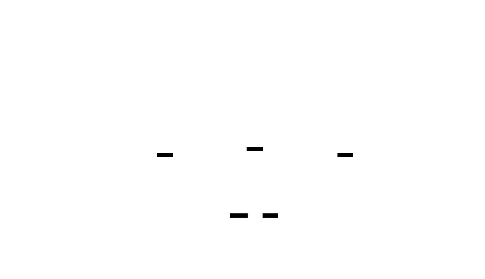

---
hide:
  - navigation
---

# The Factory

**A harness for agentic software evolution — detect, delegate, evaluate, archive.**

The Factory takes any project — a repo, a vault idea, a raw prompt — and runs a structured multi-agent loop that measures and improves it. It generalizes the pattern of *detect → delegate → evaluate → archive* across any codebase.

It wraps [Claude Code](https://docs.anthropic.com/en/docs/claude-code) with a CEO agent that orchestrates six specialists (Researcher, Strategist, Builder, Reviewer, Evaluator, Archivist), each running as an independent subprocess. Every change is a hypothesis — scored before and after, kept only if it improves the score, and archived as institutional memory.

## How It Works

<figure markdown="span">
  { width="800" }
  <figcaption>Each cycle: observe the project, execute a hypothesis, measure the result, decide keep or revert.</figcaption>
</figure>

## Quick Start

```bash
# Install
pip install git+https://github.com/akashgit/remote-factory.git@v0.1.0

# Register the CEO as a Claude Code agent
factory install

# Run on any project
factory ceo ~/my-project

# Or build something new from a prompt
factory ceo --prompt "Build a CLI that converts CSV to JSON"
```

**Prerequisites:** Python 3.11+ and [Claude Code](https://docs.anthropic.com/en/docs/claude-code) (installed and authenticated).

## Self-Evolving Agents

The factory doesn't just improve your project — it improves *itself*. Every keep/revert decision becomes training data for the next cycle.

This is powered by **ACE (Autonomous Context Engineering)** — inspired by Anthropic's work on [context engineering](https://www.anthropic.com/engineering/effective-context-engineering-for-ai-agents) — a Reflect → Curate → Inject loop that evolves agent playbooks from real experiment outcomes.

```
Experiment outcomes       Reflect         Curate          Inject
(kept or reverted)   ──────────▶    ──────────▶    ──────────▶   Agent prompts
across all projects    Generate       Merge &        Auto-append
                       candidate      prune          at runtime
                       bullets        playbooks
```

Each agent accumulates behavioral rules — DOs and DON'Ts — with evidence counters. Rules that correlate with kept experiments get reinforced. Rules that correlate with reverts get pruned.

```bash
# Run a full improvement cycle, then evolve all agent playbooks
factory ceo ~/my-project --mode meta
```

See [ACE Self-Improvement](ace.md) for details.

## Architecture

<figure markdown="span">
  { width="800" }
  <figcaption>Three layers: Python CLI (pure tools), CEO Agent (orchestrator), Specialist Agents (workers).</figcaption>
</figure>

## The Eval System

<figure markdown="span">
  { width="800" }
  <figcaption>Three-tier composite scoring: Hygiene (code quality), Growth (capability evolution), Project (domain metrics).</figcaption>
</figure>

| Tier | What it measures | Examples |
|------|-----------------|---------|
| **Hygiene** (6 dimensions) | Code quality basics | Tests, lint, type checking, coverage |
| **Growth** (5 dimensions) | Capability evolution | API surface area, experiment diversity, observability |
| **Project** (user-defined) | Domain-specific metrics | Benchmark accuracy, latency, win rate |

## What Can It Do?

| Input | What happens |
|-------|-------------|
| `factory ceo ~/my-project` | Discovers eval dimensions, then runs improvement cycles |
| `factory ceo https://github.com/user/repo` | Clones the repo, then improves it |
| `factory ceo --prompt "Build a weather CLI"` | Scaffolds a new project from scratch |
| `factory ceo ~/my-project --focus "auth"` | Narrows improvements to a specific area |
| `factory ceo ~/my-project --mode meta` | Improves the factory's own agent playbooks |
| `factory run ~/my-project --loop` | Continuous heartbeat — runs every 30 min |

## License

[MIT](https://github.com/akashgit/remote-factory/blob/main/LICENSE) — Akash Srivastava
