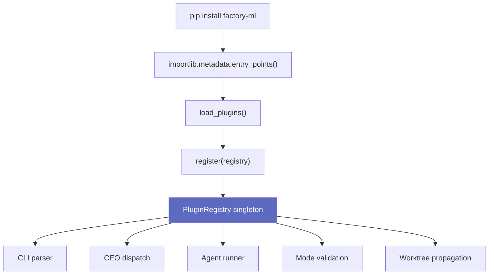

# Plugins — Build Your Own Factory

re:factory is an **engine**. The built-in modes (improve, design, research, build, etc.) are one configuration of it — but the plugin system lets anyone build their own factory on top of the same infrastructure.

A plugin is a pip-installable Python package that registers new capabilities with the engine. The factory discovers plugins at startup via standard Python [entry points](https://packaging.python.org/en/latest/specifications/entry-points/), the same mechanism pip and pytest use. Everything the engine provides — [eval scoring](eval.md), [keep/revert decisions](architecture.md#experiment-loop-improve-mode), [archival](self-improvement.md#archive-and-performance-reports), [crash recovery](architecture.md) — works automatically for plugin modes.

## Extension Surfaces

A plugin's `register()` function receives a `PluginRegistry` and can extend six surfaces:

| Surface | What it does | Example |
|---------|-------------|---------|
| **CEO modes** | New modes for `factory ceo --mode <name>` | An `ml` mode that runs paper-survey → hypothesize → train → eval |
| **Agent roles** | New specialist agents for `factory agent <role>` | A `paper-reader` that extracts techniques from arxiv papers |
| **CLI commands** | New top-level `factory` subcommands | `factory ml-report` to summarize experiment results |
| **CEO pre-hooks** | Logic that runs before CEO dispatch | Scaffold a `.factory/ml/` config directory on first run |
| **Parser extensions** | Inject flags into existing subcommands | Add `--metric` and `--gpu` to `factory ceo` |
| **Workflow search paths** | Additional directories for [workflow definitions](architecture.md) | Point the engine at the plugin's workflow graphs |

## How a Plugin Mode Runs

When you run `factory ceo /path --mode ml`:

```
                    ┌─────────────────────┐
                    │   factory ceo       │
                    │   --mode ml         │
                    └────────┬────────────┘
                             │
                    ┌────────▼────────────┐
                    │  1. Pre-hooks       │  Plugin's pre-hook runs
                    │                     │  before CEO dispatch
                    └────────┬────────────┘
                             │
                    ┌────────▼────────────┐
                    │  2. Mode playbook   │  CEO reads workflow skill file
                    │                     │  (skills/workflow-ml/SKILL.md)
                    └────────┬────────────┘
                             │
              ┌──────────────▼──────────────┐
              │  3. Agent dispatch           │
              │                              │
              │  paper-reader ──► strategist │  Plugin + built-in agents
              │       ──► experiment-runner  │  composed freely
              │       ──► run_eval          │
              └──────────────┬──────────────┘
                             │
                    ┌────────▼────────────┐
                    │  4. Engine takes     │  Standard experiment
                    │     over             │  lifecycle from here
                    └─────────────────────┘
```

Plugin workflows can mix plugin-defined agents (`paper-reader`) with built-in agents (`strategist`, `builder`). Registering a role via `add_agent_roles()` extends the `AgentRole` enum, so the role works inside workflow graphs (`AgentNode(role=...)`), in the CLI, and in serialization roundtrips — use the enum member (`AgentRole.PAPER_READER`) or the role string where builtins accept strings.

### Prompt resolution contract for plugin roles

Registering a role makes it *valid*; its prompt makes it *behaved*. Roles resolve through the [three-tier lookup](architecture.md#layer-3-specialist-agents), in order:

1. Project override: `<project>/.factory/agents/<role>.md`
2. User-global: `~/.factory/agents/prompts/<role>.md`
3. Factory default: `factory/agents/prompts/<role>.md` (builtins only — plugin roles have none)

A plugin role must therefore ship a prompt file and install it to tier 2 on first load (or rely on projects providing tier 1). Two safety nets catch a broken install:

- **At plugin load time**, every registered role is checked against tiers 2 and 3; a role with no resolvable prompt logs `plugin_agent_role_prompt_missing` (a project override still satisfies it, so the warning names that escape hatch).
- **At invocation time**, `resolve_prompt` raises `FileNotFoundError` naming the expected paths, with an extra hint that the role is plugin-registered when its prompt did not ship with the plugin (e.g. missing data files in the built wheel).

If no workflow exists for a plugin mode, the CEO falls back to its default improve loop using whatever agents are available.

## Collision Protection

- **Builtins always win.** A plugin cannot override a built-in command, mode, or agent role. `add_agent_roles()` skips builtin collisions with a warning; the lower-level `factory.workflow.primitives.register_agent_role()` raises `ValueError` instead.
- **First registration wins.** If two plugins register the same name, the first one (sorted by distribution name) keeps it.
- **Three-tier error isolation.** Failures at any stage (import, validation, registration) are caught, logged, and skipped — a broken plugin never crashes the factory.

## Discovery and Debugging

```bash
factory plugins          # list loaded plugins, versions, and status
pip install factory-ml   # install a plugin
pip uninstall factory-ml # remove — discovery is dynamic, no config to clean up
```

## Integration Points

The `PluginRegistry` singleton (`factory/plugins.py`) is consumed at six points in the codebase:

| File | What it reads |
|------|--------------|
| `factory/cli/_main.py` | Plugin commands → subparsers; parser extensions → existing subcommands |
| `factory/cli/_main.py` | Plugin command handlers dispatched via `_plugin_handler` |
| `factory/cli/ceo.py` | Pre-hooks invoked before CEO dispatch |
| `factory/cli/_helpers.py` | `get_all_ceo_modes()` merges builtins + plugin modes |
| `factory/cli/agents.py` | Agent role validation unions builtins + plugin roles |
| `factory/worktree.py` | Plugin-created `.factory/` subdirs propagated into CEO worktrees |

## Writing a Plugin

A minimal plugin needs three things:

1. A Python package with a `register(registry: PluginRegistry)` function
2. An entry point declaration in `pyproject.toml` under `factory.plugins`
3. Agent prompt files for any custom roles

The `register()` function calls `add_modes()`, `add_agent_roles()`, `add_commands()`, `add_ceo_pre_hook()`, `add_parser_extensions()`, and `add_workflow_search_path()` on the registry. See `factory/plugins.py` for the full API — `PluginRegistry` and `CommandSpec` are the only imports needed.

```toml
# pyproject.toml — the entry point is all the factory needs to find your plugin
[project.entry-points."factory.plugins"]
ml = "factory_ml:register"
```


