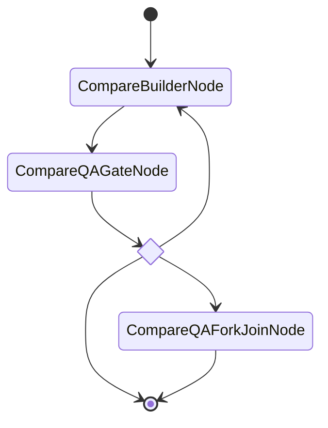

# Comparison Report: pydantic-graph vs Current Engine

## Side-by-Side Event Traces

Both engines execute the same workflow: `builder → qa_gate → fork_qa(3 QA agents)`.
The comparison harness (`src/pg_factory/compare.py`) defines this workflow in both
representations and runs them with identical verdict sequences.

### PROCEED Path

| Step | Current Engine                        | pydantic-graph                        |
|------|---------------------------------------|---------------------------------------|
| 1    | builder: execute                      | builder: execute                      |
| 2    | qa_gate: gate_verdict (proceed)       | qa_gate: gate_verdict (proceed)       |
| 3    | fork_qa: fork (3 targets)             | fork_qa: child_completed (health_checker) |
| 4    | health_checker: execute               | fork_qa: child_completed (code_reviewer) |
| 5    | code_reviewer: execute                | fork_qa: child_completed (adversarial_tester) |
| 6    | adversarial_tester: execute           | fork_qa: fork_join_complete           |
| 7    | fork_qa: fork_join_complete           | —                                     |
| 8    | join_qa: join                         | —                                     |

**Key difference:** The current engine uses separate fork/join nodes and records each
branch as an independent "execute" event. pydantic-graph encapsulates the fork/join
inside a single `ForkJoinNode`, recording children as `child_completed` events with
per-child timing data. The JoinNode barrier is implicit.

### RELOOP → PROCEED Path

| Step | Current Engine                        | pydantic-graph                        |
|------|---------------------------------------|---------------------------------------|
| 1    | builder: execute                      | builder: execute                      |
| 2    | qa_gate: gate_verdict (reloop → builder) | qa_gate: gate_verdict (reloop)     |
| 3    | builder: execute (2nd time)           | builder: execute (2nd time)           |
| 4    | qa_gate: gate_verdict (proceed)       | qa_gate: gate_verdict (proceed)       |
| 5-8  | fork + 3 children + join              | 3 child_completed + fork_join_complete |

**Key difference:** Both engines re-execute the builder on RELOOP. The current engine
routes via string-based edge matching (`Edge(source="qa_gate", target="builder",
condition="reloop")`). pydantic-graph routes via the gate's return type — returning
`CompareBuilderNode(...)` directly, with the type system ensuring only valid targets
are returned.

### HALT Path

| Step | Current Engine                        | pydantic-graph                        |
|------|---------------------------------------|---------------------------------------|
| 1    | builder: execute                      | builder: execute                      |
| 2    | qa_gate: gate_verdict (halt)          | qa_gate: gate_verdict (halt)          |

Identical behavior — both stop immediately after gate HALT.


## Lines-of-Code Comparison

### Workflow Definition Patterns

| Component               | Current Engine (definitions.py) | pydantic-graph (BaseNode) |
|--------------------------|--------------------------------|---------------------------|
| Study chain (4 nodes)   | 51 lines (dict + Edge list)    | 154 lines (4 BaseNode classes) |
| Gate routing             | ~40 lines (GateNode + edges)   | 85 lines (GateBaseNode)  |
| Fork/join (3 branches)  | 76 lines (Fork + Join + edges) | 111 lines (ForkJoinNode) |
| **Total node definitions** | **~167 lines**              | **350 lines**             |

### Infrastructure

| Component               | Current Engine               | pydantic-graph              |
|--------------------------|-----------------------------|-----------------------------|
| Node/Edge primitives     | 322 lines (primitives.py)   | 73 lines (state + deps + verdicts) |
| Executor                 | 1,135 lines (executor.py)   | 0 lines (Graph.run provided by library) |
| **Total infrastructure** | **1,457 lines**             | **73 lines**                |

### Analysis

Node definitions are **~2x longer** in pydantic-graph because each node is a full
class with typed `run()` method, docstring, and explicit state interaction. The
current engine's dict-based style is more compact for definition.

However, pydantic-graph **eliminates 1,457 lines of infrastructure** — the entire
executor, edge-walking logic, fork dispatch, gate verdict parsing, and read/write
polling. This is handled by `Graph.run()` / `Graph.iter()` from the library.

**Net LOC change for equivalent functionality:**
- Current engine: 167 (definitions) + 1,457 (infrastructure) = **1,624 lines**
- pydantic-graph: 350 (definitions) + 73 (types) = **423 lines**
- **Reduction: 74%**


## Type Safety Analysis

### What pyright catches in pydantic-graph that the current engine misses

| Misconfiguration                    | Current Engine        | pydantic-graph (pyright strict) |
|-------------------------------------|-----------------------|---------------------------------|
| Misspelled edge target              | Runtime error         | Compile-time type error         |
| Gate returns invalid successor      | Runtime edge mismatch | Return type annotation error    |
| Missing node in workflow            | Runtime KeyError      | Import/reference error          |
| Wrong state field type              | Runtime TypeError     | Type error on state access      |
| Fork target not in node dict        | Silent no-op          | N/A (no separate fork targets)  |
| Gate verdict with no matching edge  | Runtime halt          | N/A (exhaustive return union)   |

**Example — invalid gate routing:**

Current engine (detected only at runtime):
```python
# This silently compiles but crashes at runtime when the gate returns RELOOP
edges = [
    Edge(source="qa_gate", target="buildr", condition="reloop"),  # typo!
]
```

pydantic-graph (caught by pyright):
```python
class QAGateNode(GateBaseNode):
    async def run(self, ctx) -> BuilderNode | NextNode | End[HaltResult]:
        return Buildr()  # pyright error: "Buildr" is not defined
```

### What the current engine checks that pydantic-graph doesn't

| Check                              | Current Engine        | pydantic-graph              |
|------------------------------------|-----------------------|-----------------------------|
| File reads/writes dependencies     | `reads`/`writes` sets on nodes | No equivalent (state-based) |
| Graph connectivity validation      | `validate_graph()` via NetworkX | Return type inference only |
| Circular dependency detection      | Edge-based cycle check | Not checked (cycles are valid via reloop) |


## Mermaid Diagram Comparison

### pydantic-graph (auto-generated via `Graph.render()`)



### Current engine (no built-in visualization)

The current engine has no Mermaid generation capability. Workflow topology must be
manually reconstructed from `dict[str, NodeType]` + `list[Edge]` definitions. There
is a `validate_graph()` method using NetworkX, but no rendering.

### Assessment

pydantic-graph's `Graph.render()` produces valid Mermaid state diagrams with zero
configuration. Gate routing appears as a `<<choice>>` decision node showing all
possible successors. The one limitation: `ForkJoinNode` appears as a single node
rather than a visual fan-out of branches — the internal parallelism is only visible
through event timing data, not the diagram.


## Feature Matrix

| Feature                         | Current Engine | pydantic-graph | Notes                                |
|---------------------------------|:--------------:|:--------------:|--------------------------------------|
| Sequential chains               |       ✓        |       ✓        | Both handle linear node sequences    |
| Gate/verdict routing             |       ✓        |       ✓        | PG uses return types; current uses edges |
| Iteration counting (max_iter)   |       ✓        |       ✓        | Both track (gate, target) counts     |
| Feedback injection              |       ✓        |       ✓        | Both pass context on RELOOP          |
| Parallel fork/join              |       ✓        |       ✓        | Both use asyncio.gather              |
| `reads`/`writes` file deps      |       ✓        |       ✗        | PG uses typed state instead          |
| Non-blocking (fire-and-forget)  |       ✓        |       △        | PG needs asyncio.create_task wrapper |
| SubgraphForkNode (N worktrees)  |       ✓        |       ✗        | No PG equivalent — stays custom      |
| SelectionNode (branch compare)  |       ✓        |       ✗        | No PG equivalent — stays custom      |
| LLMNode (in-process API loop)   |       ✓        |       ✗        | Not related to graph execution       |
| Mermaid diagram generation      |       ✗        |       ✓        | PG auto-generates from types         |
| Compile-time edge validation    |       ✗        |       ✓        | pyright strict mode                  |
| Step-by-step iteration          |       ✗        |       ✓        | Graph.iter() async context manager   |
| Graph persistence/resume        |       ✗        |       ✓        | Built into pydantic-graph (untested) |

**Key:** ✓ = fully supported, △ = partial/workaround, ✗ = not supported

### What pydantic-graph replaces

- Edge-based graph walking (`_execute_from`, `_next_unconditional`, `_next_conditional`)
- Gate verdict parsing (`_parse_agent_verdict`, `_parse_fn_verdict`)
- Fork dispatch (`_execute_fork` + `run_branch` + gather)
- Node execution dispatch (`_run_node`, `_execute_action_node`)
- Event emission plumbing

### What stays custom

- `SubgraphForkNode` (parallel experiments in isolated worktrees)
- `SelectionNode` (best-score comparison across branches)
- `LLMNode` (in-process API tool-use loop)
- `reads`/`writes` file dependency polling
- Agent invocation (`invoke_agent` subprocess management)

### What's lost

- `reads`/`writes` declarative file dependencies — replaced by typed state fields,
  which are more type-safe but less explicit about filesystem artifacts
- Flat dict-based workflow construction — replaced by class hierarchies, which are
  more verbose but catch more errors at compile time
- Graph validation via NetworkX — replaced by type-system edge inference, which
  catches a different (and largely overlapping) class of errors
